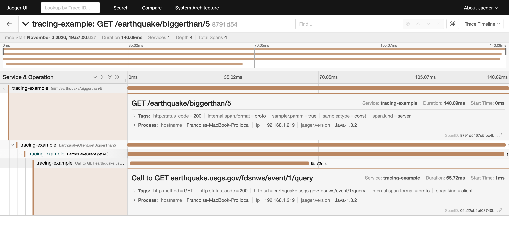

## Earthquake API 

Example Ktor application instrumented with OpenTracing using [ktor-opentracing](https://github.com/zopaUK/ktor-opentracing). 

Retrieves data about earthquakes that happened today using an [API from the U.S. Geological Survey](https://earthquake.usgs.gov/fdsnws/event/1/). 

### Running

1. Start an [all-in-one Jaeger backend](https://www.jaegertracing.io/docs/1.20/getting-started/) with in-memory storage.

        docker run -d --name jaeger \
          -e COLLECTOR_ZIPKIN_HTTP_PORT=9411 \
          -p 5775:5775/udp \
          -p 6831:6831/udp \
          -p 6832:6832/udp \
          -p 5778:5778 \
          -p 16686:16686 \
          -p 14268:14268 \
          -p 14250:14250 \
          -p 9411:9411 \
          jaegertracing/all-in-one:1.20
             
2. Start the application.

        ./gradlew run
        
3. Send some requests. Other routes available are `/earthquake/biggest` and `/earthquake/biggerthan/5` (where 5 is a parameter).

        curl localhost:8080/earthquake/latest
        {
          "location" : "21 km SSE of Karluk, Alaska",
          "magnitude" : 1.9,
          "timeGMT" : "2020-11-02 09:46:39"
        }  
        
4. See traces in Jaeger.

    http://localhost:16686/

5. Stop the Jaeger docker container.

        docker ps
        docker stop <containerId>

### Steps

1. Import [ktor-opentracing](https://github.com/zopaUK/ktor-opentracing) and the [Java Jaeger client](https://github.com/jaegertracing/jaeger-client-java) [(commit)](https://github.com/fstien/ktor-opentracing-example/commit/a6c43669e532683c6eef2e36c525087c882a9335).

        implementation "io.jaegertracing:jaeger-client:1.3.2"
        implementation "com.zopa:ktor-opentracing:0.3.5"

2. Instantiate a tracer and register it in [GlobalTracer](https://opentracing.io/guides/java/tracers/) [(commit)](https://github.com/fstien/ktor-opentracing-example/commit/998f2228289493b37f9c3e86061b31cd7d24f689).

        val tracer = Configuration("tracing-example")
            .withSampler(Configuration.SamplerConfiguration.fromEnv()
                .withType(ConstSampler.TYPE)
                .withParam(1))
            .withReporter(Configuration.ReporterConfiguration.fromEnv()
                .withLogSpans(true)
                .withSender(
                    Configuration.SenderConfiguration()
                        .withAgentHost("localhost")
                        .withAgentPort(6831))).tracerBuilder
            .withScopeManager(ThreadContextElementScopeManager())
            .build()
        
        GlobalTracer.registerIfAbsent(tracer)

3. Install the `OpenTracingServer` feature into the application call pipeline [(commit)](https://github.com/fstien/ktor-opentracing-example/commit/9d9f06f96d34133c95878e8e352a78e64096b2fc).

        install(OpenTracingServer)
        
4. Install the `OpenTracingClient` feature onto the http client [(commit)](https://github.com/fstien/ktor-opentracing-example/commit/86505c0437ae909079c2e388f1015fe849b6f8a1). 

        install(OpenTracingClient)
5. Instrument method calls using the `span` helper function [(commit)](https://github.com/fstien/ktor-opentracing-example/commit/78110aef2a97c4af0f7cbc32125e7e1e1bfc55c1).

        = span("EarthquakeClient.getBiggest()") {

    From the lamdba expression passed to `span`, you can add tags or logs to the span by calling `setTag()` or `log()`.
